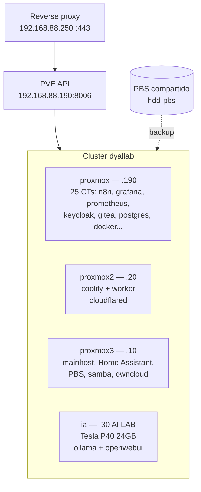

# Correr LLMs en tu casa con una Tesla P40: crónica de un quilombo hermoso

> O como pasé de pagar suscripciones de IA a pelearme con drivers, fuentes, coolers y compilaciones de CUDA a las 3AM. Y no me arrepiento de nada.

---

## Che, ¿para qué quiero un LLM local?

Mira, la idea era simple. Eso de pagar 20 dólares por mes a cada servicio de IA me tenía podrido. Que ChatGPT, que Claude, que no se qué. Y además todo pasa por la nube de otro.

Entonces me pintó la idea del **AI Lab casero**: armarme un fierro en casa, correr modelos open-weight ahí, bancharlos, y usarlos para generar código, automatizar boludeces, experimentar.

El repo donde fui anotando todo es [jd-llm](https://github.com/jd-apprentice/jd-llm). Al principio era solo un `bench.sh` + un par de READMEs. Terminó siendo un diario de guerra contra una GPU del 2016.

Si te interesa la parte técnica pura, andá directo a `BENCHMARKS.md` y `scripts/bench.sh`. Esto de acá es la historia humana atrás de eso.

## El fierro

Lo que tengo hoy corriendo Proxmox 9:

```sh
OS: Proxmox 9
Kernel: Linux 7.0.14-15-pve
CPU: AMD Ryzen 5 3400g
GPU: NVIDIA Tesla P40
Memory: 8GB DDR4 2400 MHz x2
```

Y la lista de compras del [issue #1](https://github.com/jd-apprentice/jd-llm/issues/1), que es básicamente mi lista del súper pero nerd:

- Storage Shelf (50 USD)
- NVIDIA Tesla P40 (350 USD)
- RJ45 Cat 5e (5 USD)
- Carry Disk 2.5 USB 3.0 x1 (20 USD)
- Power Cable (15 USD)
- PSU Corsair 750w (150 USD)
- B450M Gaming Pro + Ryzen 5 3400g (gratis, rescatado)

O sea, por menos de 600 dólares te armás un laburo que te corre modelos de 1B hasta 35B local. Suena lindo, ¿no? Bueno, agarrate.

El lab ya existía de antes, el estante de 50 dólares fue un upgrade para tener más lugar y ordenar el quilombo:


Y con los fierros arriba ya iba tomando forma de AI Lab en serio:


## Dónde corre todo esto: el cluster dyallab

Ojo que no es una sola máquina. Tengo un cluster Proxmox (`dyallab`, PVE 9.2.6) con 4 nodos, 6 VMs y 32 containers. La P40 vive en uno solo de ellos. Así se ve hoy, relevado vía API:



- **proxmox (.190)**: el que labura todos los días. 25 containers con todo el stack: n8n, grafana, prometheus, loki, influxdb, keycloak, lldap, authelia, gitea, postgresql, docker, romm, searxng, stirling-pdf y más. El openwebui que está acá (117) lo tengo apagado, el que vale es el del nodo `ia`.
- **proxmox2 (.20)**: coolify (106) + coolify-worker-1 (129) y cloudflared (110) para exponer cosas.
- **proxmox3 (.10)**: mainhost (108), Home Assistant (109), el Proxmox Backup Server (103) y samba/owncloud.
- **ia (.30)**: el AI Lab propiamente dicho. Ryzen 5 3400G, 16GB RAM, y la P40 pinchada (`GP102GL [Tesla P40]` según el PCI). Acá viven el CT 127 `ollama` (4c/4G) y el 128 `openwebui` (4c/8G), más una VM 112 `veloren` corriendo (un server de jueguitos en el nodo de IA, nadie sabe nada, nadie vio nada 🤫).

El único storage compartido entre los 4 es `hdd-pbs` (backups). Todo lo demás es local de cada nodo.

## La P40: barata por algo

La Tesla P40 es una bestia: 24GB de VRAM, Pascal, arquitectura `sm_61`, pensada para datacenter. En eBay la conseguís por 350 dólares porque los datacenters las tiran. 24GB por esa plata no existe en una gamer.

Pero es barata por algo. Es una placa **sin cooler, sin salida de video, sin nada**. Es un ladrillo que tira 250W de calor y espera que el servidor donde esté puesta le sople aire con turbinas de avión.

Yo no tengo un servidor. Tengo un Proxmox en mi casa.

### 1. La refrigeración villera

Abro el [issue #11](https://github.com/jd-apprentice/jd-llm/issues/11): "Cooling solution for the Tesla P40".

Mi solución actual es literalmente un ventilador de pie apuntándole a la GPU. Flujo de aire tipo "cerca -> frente". Con el ventilador al 1 o 2, las temps se quedan en 90 grados. Que no es lo mejor, pero antes de tener el enclosure 3D, funciona.

Me falta todavía: el enclosure impreso en 3D + un fan posta. Está en la lista de "Missing". Mientras tanto, verano argentino + P40 a 90 grados = sauna gratis.

### 2. La fuente no bancaba

Llega la GPU, todo contento, foto para el issue. La tengo en la mano, es un ladrillo hermoso:


La pincho... y la máquina no bootea.

Confirmado: **mi PSU no banca la P40**. Ping raro, sin SSH, delays random. Tuve que comprar una Corsair de 750w (150 USD, lo más caro después de la GPU). Más mother + CPU con iGPU para poder tener video mientras peleaba.

Porque ese es otro tema:

### 3. Es headless, o sea, estás ciego

La P40 no tiene HDMI, no tiene DisplayPort, no tiene nada. Si tu CPU tampoco tiene iGPU (como un Ryzen 5 2600), te quedás **ciego**. La mother hace el check de VGA, no hay imagen, "blind boot".

Lo documenté en el [issue #10](https://github.com/jd-apprentice/jd-llm/issues/10):

> when using the P40 computer won't start properly, I can ping it but there is no ssh service and since I don't have any sort of image I can't plug a monitor.

Intenté mandar logs por grub + rsyslog para debuggear a ciegas. No llegaba ni a systemd. Un dolor de huevos total.

La solución temporal: usar un APU (el 3400g tiene iGPU) para tener video. Pero eso me trajo el próximo problema...

### 4. PCIe x8 en vez de x16, la trampa del APU

Hago `nvidia-smi -q | grep -A15 -i "PCI"` y veo:

```
Link Width
    Max     : 16x
    Current : 8x
```

¿¿Cómo que x8?? La P40 es x16.

Resulta que los Ryzen con G (APU, con integrada) **físicamente solo te dan 8 lanes PCIe al slot principal**. Los otros lanes se los come la iGPU. No hay BIOS que lo arregle, es silicio. O tenés video integrado o tenés ancho de banda completo. No podés tener las dos.

La VRAM interna sigue yendo a 346 GB/s, pero el link CPU<->GPU queda a la mitad (~8 GB/s en vez de 16). Eso te pega directo en los tokens por segundo cuando el prompt es grande. Lo medí, lo sufrí.

Elegí quedarme con el APU por ahora porque prefiero poder ver qué pasa antes que un 5% más de throughput. Ya migraré cuando tenga una plaquita de video barata para debug.

### 5. El infierno de los drivers: 610 open vs 580 proprietary

Este fue el boss final. Instalás la P40, hacés `nvidia-smi` y te escupe:

```
NVIDIA-SMI has failed because it couldn't communicate with the NVIDIA driver.
```

Yo estaba en driver `610.57.04` con módulo **open**. Y ahí está la trampa: el módulo open solo soporta GPUs con GSP (Turing para arriba). La P40 es Pascal, no tiene GSP. El `dmesg` te lo dice en la cara:

```
NVRM: ... is not supported by open nvidia.ko because it does not include
the required GPU System Processor (GSP).
```

Además la rama 610 ya dropeó Pascal por completo. La **última rama que banca Pascal es la 580**, que llega hasta CUDA 13.0.

Lo que tuve que hacer, todo a mano:

```bash
# volar el 610
dkms remove nvidia/610.57.04 --all
apt-get remove -y --purge nvidia-driver nvidia-driver-cuda nvidia-kernel-open-dkms

# instalar el 580 proprietary con DKMS
./NVIDIA-Linux-x86_64-580.178.04.run --silent --dkms --no-opengl-files
update-initramfs -u -k all
```

Recién ahí:

```
|   0  Tesla P40   ...   0MiB /  23040MiB |
```

31 grados, 45W en idle. Lloré un poquito.

### 6. Compilar llama.cpp porque no te queda otra

Pensé "listo, ya está". No. Ahora viene CUDA.

- CUDA Toolkit **13.x dropeó soporte para sm_61** (todo lo anterior a sm_70 afuera).
- El driver 580 banca hasta CUDA 13, pero para compilar para Pascal necesitás CUDA **12.8**.
- El instalador `llama.app` solo trae builds contra el CUDA más nuevo, cuyo driver mínimo el 580 no cumple. Entonces su probe falla silencioso y te cae a **binario CPU-only**. Vos creés que estás en GPU y estás en CPU. Hermoso.

Solución: compilar desde source, branch `b10826`:

```bash
git clone --depth 1 --branch b10826 https://github.com/ggml-org/llama.cpp
cmake -B build \
  -DGGML_CUDA=ON \
  -DCMAKE_CUDA_ARCHITECTURES="61" \
  -DCMAKE_BUILD_TYPE=Release
cmake --build build --target llama-app -j 2
```

Detalles que me costaron horas:
- `-j 2` porque con 4GB de RAM se te muere compilando CUDA.
- Después `cp build/bin/llama-server ~/.local/bin/` + copiar los `.so*` a `/usr/local/lib` + `ldconfig`.
- **NO corras `llama update` nunca más**, te pisa el build CUDA con el CPU-only.
- Sanity check: el log tiene que decir `CUDA0: Tesla P40`, y `curl http://<host>:8080/health` tiene que responder.

Una vez que ves ese `CUDA0: Tesla P40`, sos Gardel.

## Los benchmarks: GTX 1660 vs P40, no hay comparación

El `bench.sh` hoy es server-only. No hace inferencia local, solo le pega a `POST /completion` al `llama-server` que ya está corriendo con el modelo cargado (`-c 8192`), con prompt de token-ids exactos, `cache_prompt: false`, `ignore_eos: true`, y mide `.timings`.

9 tests fijos, en orden: `pp1024+tg16, pp4096+tg256, pp2048+tg256, pp2048+tg768, pp1024+tg1024, pp1280+tg3072, pp384+tg1152, pp64+tg1024, pp16+tg1536`.

Te doy un ejemplo para que se te caiga la baba. Llama 3.2 1B Q4_K_M:

**GTX 1660 6GB:**
`pp1024+tg16 | 6.36s | PP 163 t/s | TG 166 t/s | TTFT 6.27s`

**Tesla P40 24GB:**
`pp1024+tg16 | 310ms | PP 4340 t/s | TG 194 t/s | TTFT 230ms`

Leíste bien. De 6 segundos a 300 milisegundos en prompt processing. El TTFT se fue de 6 segundos a 0.23. La generación también mejora, pero donde la P40 te destroza es en prefill.

Con modelos chicos (Qwen 0.8B, Gemma 1B, FableForge 1.5B) es la misma historia. Y con modelos de 7-9B (Qwen2.5 7B, Ornith 9B, Bonsai 27B Q1_0) la 1660 directamente se arrastra o necesita offload con NGL sweep, mientras la P40 ni se mosquea con sus 23GB libres.

Pasamos de "che, anda" a "che, esto es usable posta para laburar".

Todo validado con `shellcheck` en CI + pre-commit hook que te valida el formato de `BENCHMARKS.md` (títulos H3, columnas, orden de tests). Porque si vamos a sufrir, suframos ordenados.

## ¿Y para qué sirve? Los ejemplos

La mejor parte: con un `qwen3.6:35b-a3b` corriendo local vía Ollama, generé proyectos enteros sin llamar a ninguna API:

- **veterinary-web** — landing de veterinaria con React 19 + Tailwind + Vite, deployada en [local-llm-example-1.jonathan.com.ar](https://local-llm-example-1.jonathan.com.ar)
- **retro-games** — catálogo arcade con pixel fonts, glow, scanlines, y hasta 5 jueguitos jugables (PacMan, Tetris, SpaceInvaders...), en [local-llm-example-2.jonathan.com.ar](https://local-llm-example-2.jonathan.com.ar)
- **todo-list** — un CLI en Bash (`./todo.sh add/list/done/ai`) con asistente IA integrado vía `http://localhost:11434`.

Todo eso salió de un modelo corriendo en mi casa, en Proxmox, con un ventilador de pie al lado. Si eso no es cyberpunk argentino, no sé qué es.

Y las ideas que quedaron en el [issue #5](https://github.com/jd-apprentice/jd-llm/issues/5) son las que más me manijean: automatizar WhatsApp para dyabox, scrapear Zonaprop, auto-responder tickets de GitHub, meter SearXNG a los agentes, jugar con OpenWebUI / AnythingLLM / n8n. Ahora que la GPU anda, se viene esa parte.

## Cierre: ¿vale la pena?

Posta, sí. Pero con ojos abiertos:

**Lo bueno:**
- 24GB VRAM por 350 USD no existe en otro lado.
- Privacidad total, cero costo por token, experimentás sin miedo.
- Aprendés una banda: PCIe, drivers, CUDA, llama.cpp, benchmarks reales.

**Lo malo:**
- Es hardware de datacenter en un gabinete hogareño. Calienta, hace ruido, gasta 250W.
- Sin cooler, sin video, driver viejo, toolkit viejo, compilar todo a mano.
- Necesitás maña con Linux. Proxmox + DKMS + initramfs no es para cualquiera.

Si me preguntás si lo volvería a hacer: obvio. Cada vez que veo `CUDA0: Tesla P40` en el log y un modelo escupiendo 190 t/s al lado de mi cama, con el ventiladorcito de fondo, pienso "qué hermoso quilombo me armé".

Y este es el estado actual del desastre, a cara de perro, cables por todos lados pero andando ([foto del issue](https://github.com/jd-apprentice/jd-llm/issues/1#issuecomment-5753642077)):


Y todavía me falta el enclosure 3D. Cuando lo tenga, cierro el issue #11 y abro un champagne.

---

*Stack: Proxmox 9, Tesla P40 24GB, Ryzen 5 3400g, llama.cpp b10826 (CUDA 12.8, sm_61), driver 580.178.04 proprietary, bench.sh server-only. Todo trackeado en [jd-llm](https://github.com/jd-apprentice/jd-llm).*
